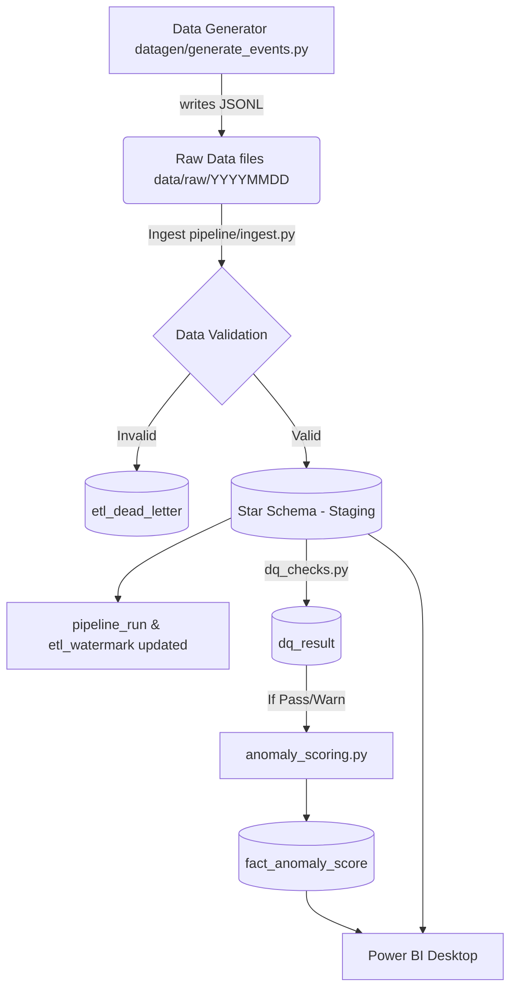

# Data Flow Diagram

```mermaid
graph TD
    A[Data Generator datagen/generate_events.py] -->|writes JSONL| B(Raw Data files data/raw/YYYYMMDD)
    B -->|Ingest pipeline/ingest.py| C{Data Validation}
    C -->|Invalid| D[(etl_dead_letter)]
    C -->|Valid| E[(Star Schema - Staging)]
    E --> F[pipeline_run & etl_watermark updated]
    E -->|dq_checks.py| G[(dq_result)]
    G -->|If Pass/Warn| H[anomaly_scoring.py]
    H --> I[(fact_anomaly_score)]
    I --> J[Power BI Desktop]
    E --> J
```
